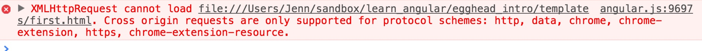
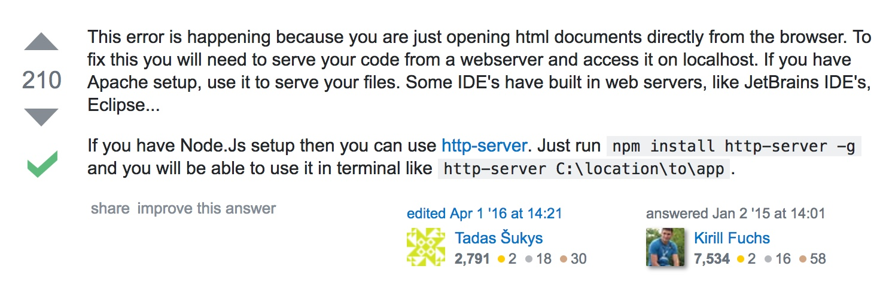

<https://egghead.io/lessons/angularjs-sharing-data-between-controllers>

Instead of using ng-controller on an element, it’s preferred to use one controller for state

* requires UI-router
* will allow you to share data across states and templates

```js
// app.js
angular.module("app", ["ui.router"]) // second argument is list of dependencies

  // to add a state for our controller allows us to config application before it boots up
  .config(function config($stateProvider){
    $stateProvider.state("index", {
      // second argument is a configuration object that takes in url, controller, and template
      url: "",
      // FirstCtrl will map to controller, first is how it will be referenced in html
      controller: "FirstCtrl as first",
      templateUrl: "templates/first.html"
    })
  })
  .controller("FirstCtrl", function FirstCtrl(){
    var first = this;

    first.greeting = "First"
  })
```

```html
// index.html
<!--not just for rendering to page, can also be used to create classes such as below using ng-class -->
<!DOCTYPE html>
<html ng-app="app"> <!-- to instantiatle the angular applciation, need to set it to something to register controller -->
  <head>
    <meta charset="utf-8">
    <link rel="stylesheet" type="text/css" href="https://maxcdn.bootstrapcdn.com/bootstrap/3.3.7/css/bootstrap.min.css">
    <script type="text/javascript" src="https://cdnjs.cloudflare.com/ajax/libs/angular.js/1.3.3/angular.js"> </script>
    <script type="text/javascript" src="https://cdnjs.cloudflare.com/ajax/libs/angular-ui-router/0.2.11/angular-ui-router.js"> </script>
    <script type="text/javascript" src="app.js"> </script>
  </head>
  <body> <!-- controller now removed since the state will map the controller and appropriate views -->
    <ui-view></ui-view> <!-- now dynamic via router -->
  </body>
</html>
```

```html
// templates/first.html
<input type="text" ng-model="first.greeting" /> <!-- set it to ng-model equal to hello, when changing the input field this will change the value in the h1 tag to show the angular js application is initializing and spinning up -->

<div ng-class="first.greeting">
  {{first.greeting}} {{"World"}}
</div>
```

---

**Note**: opening index.html directly from browser gave me a cross origin error:



root cause and solution: <http://stackoverflow.com/questions/27742070/angularjs-error-cross-origin-requests-are-only-supported-for-protocol-schemes/27743373>

```html
$ http-server {pwd to project directory}
```



---

### Sharing data across to states/controllers/views

* index.html was unchanged

```html
// templates/second.html
<h1>{{second.greeting.message}}</h1>
```

```html
// templates/first.html
<input type="text" ng-model="first.greeting.message" /> <!-- set it to ng-model equal to hello, when changing the input field this will change the value in the h1 tag to show the angular js application is initializing and spinning up -->

<div ng-class="first.greeting.message">
  {{first.greeting.message}} {{"World"}}
</div>

<div ui-sref="second"> Go to second </div>
<!-- when clicking the above it changes state to second -->
```

```js
// app.js
angular.module("app", ["ui.router"]) // second argument is list of dependencies

  // to add a state for our controller allows us to config application before it boots up
  .config(function config($stateProvider){
    $stateProvider.state("index", {
      // second argument is a configuration object that takes in url, controller, and template
      url: "",
      // FirstCtrl will map to controller, first is how it will be referenced in html
      controller: "FirstCtrl as first",
      templateUrl: "templates/first.html"
    })
    $stateProvider.state("second", {
      // second argument is a configuration object that takes in url, controller, and template
      url: "",
      // FirstCtrl will map to controller, first is how it will be referenced in html
      controller: "SecondCtrl as second",
      templateUrl: "templates/second.html"
    })
  })

  // to share data between states/controllers/templates we use a service
  .service("greeting", function Greeting(){
    // this scenario greeting is being treated as a constructor and returning an instance of greeting
    var greeting = this;

    greeting.message = "default";
  })

  .controller("FirstCtrl", function FirstCtrl(greeting){
    var first = this;

    first.greeting = greeting;
  })

  .controller("SecondCtrl", function SecondCtrl(greeting){
    var second = this;

    second.greeting = greeting;
  })

  // greeting was added to an argument of both controllers and set to the greeting property
  // gives us the same greeting object (service) on each controller with a message property that we can bind to from each controller
```